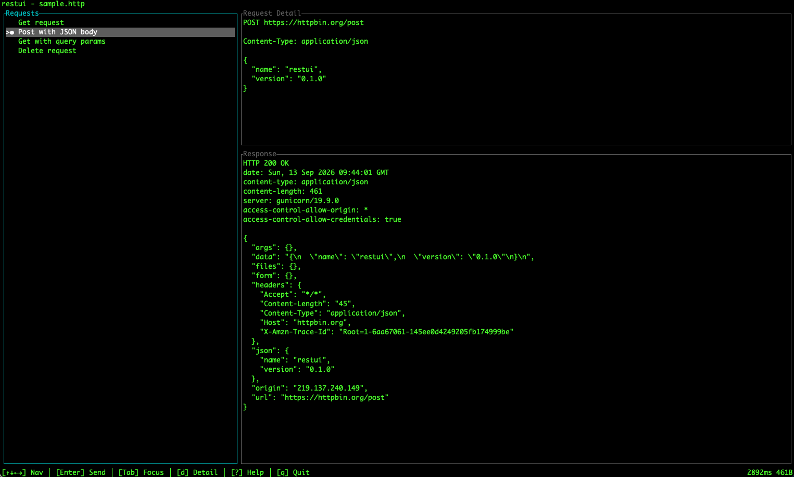
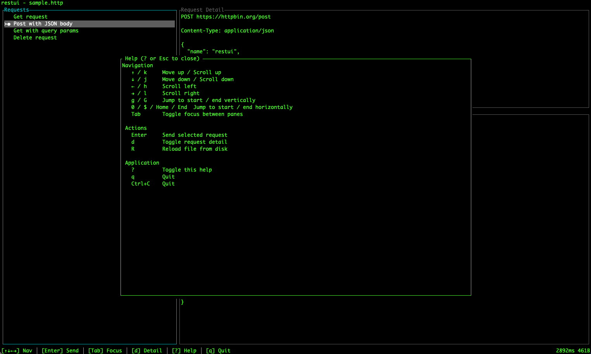

# restui

[](https://github.com/will8ug/restui/actions/workflows/ci.yml)
[](https://github.com/will8ug/restui/actions/workflows/ci.yml)

A terminal UI REST client for `.http` request files.



## Features

- Parse REST Client-style `.http` files with multiple named requests
- Resolve `{{variables}}` in URLs, headers, and bodies, including chained variables (`@a = {{b}}`)
- Send requests from a keyboard-driven terminal interface
- Inspect formatted responses, headers, timing, and size metadata
- Reload request files without restarting the app



## Installation

**npm** (prebuilt binaries for macOS arm64/x64 and Linux x64):

```bash
npm install -g @will8ug/restui
# or run once without installing:
npx @will8ug/restui file.http
```

The npm-installed shim requires Node 14+; cargo installs have no Node requirement.

**cargo** (any platform with a Rust toolchain):

```bash
cargo install --git https://github.com/will8ug/restui
```

## Usage

```bash
restui <file.http> [--timeout <secs>] [--no-verify]
```

### Command-line options

| Option | Description |
| --- | --- |
| `-h`, `--help` | Print help and exit |
| `-V`, `--version` | Print version and exit |
| `--timeout <secs>` | Request timeout in seconds (default: `30`) |
| `--no-verify` | Disable SSL certificate verification |

## Keybindings

| Key | Action |
| --- | --- |
| ↑ / k | Move selection up / Scroll up |
| ↓ / j | Move selection down / Scroll down |
| ← / h | Scroll left |
| → / l | Scroll right |
| Enter | Send selected request |
| Tab | Toggle focus between panes |
| d | Toggle request detail |
| r | Reload file from disk |
| ? | Toggle help |
| q / Ctrl+C | Quit |

## Example `.http` file

```http
@host = https://httpbin.org
@content_type = application/json

### Get request
GET {{host}}/get
Accept: {{content_type}}

### Post with JSON body
POST {{host}}/post
Content-Type: {{content_type}}

{
  "name": "restui",
  "version": "0.1.0"
}
```

## Documentation

- [TLS Troubleshooting](docs/tls.md) — Custom certificate authorities, `--no-verify`, and platform support.
- [Releasing](docs/releasing.md) — Maintainer guide to publishing a new version to npm.
